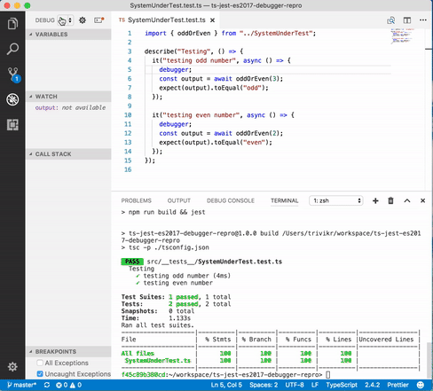

# ts-jest-es2017-debugger-repro
Repro repo for [debugger issue](https://github.com/kulshekhar/ts-jest/issues/299) with TS compilerOptions.target "es2017" and ts-jest@20.0.x

**Note:** The issue discussed here was fixed in [commit](https://github.com/trivikr/ts-jest-es2017-debugger-repro/commit/7596f75e8db6157fb95137195c0782b728b7eae4)

Steps to reproduce:
* `yarn` or `npm install` to install dependencies
* `npm run test` to build and run tests, notice that coverage is 100%
* Open the project in VSCode, go to Debug and run "Debug Tests"
* Notice that the build task runs and debugger stops one line after **debugger;** statement as shown in the screen recording below

  
  
Tested with:
* VSCode Version 1.15.1
* Node v8.4.0
* vscode-jest 2.3.0
